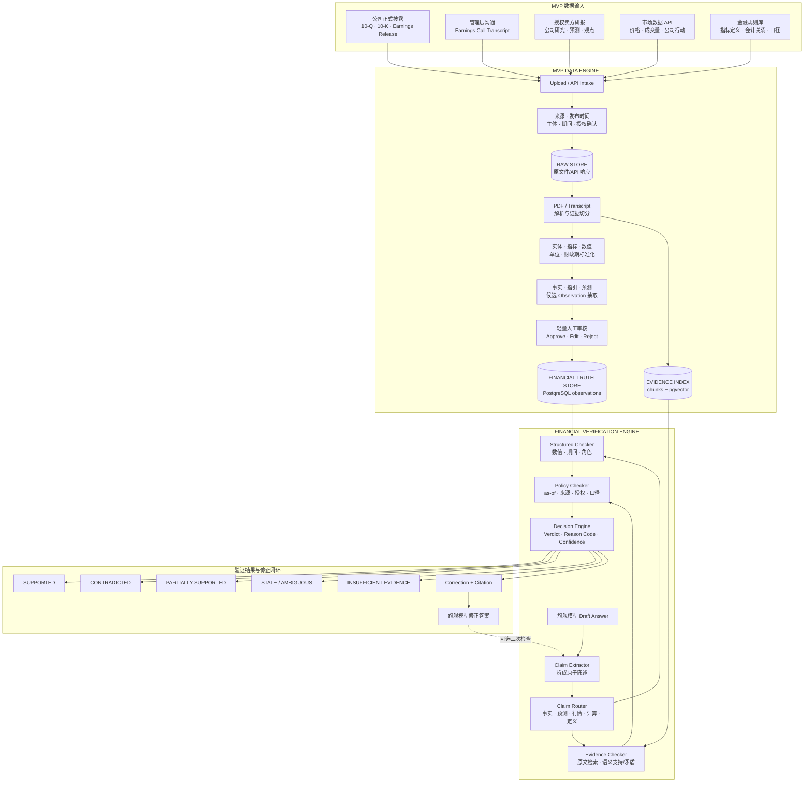

# 金融幻觉检查器：一周 MVP 架构

> 文档状态：MVP 设计 v1.0
> 开发周期：7 天
> 第一阶段定位：作为旗舰大模型的金融事实、数据与幻觉检查器
> 完整数据架构参见：[金融模型数据工程设计框架](./金融模型数据工程设计框架.md)

## 1. 产品目标

旗舰大模型负责复杂思考、综合分析和答案生成；金融幻觉检查器负责把答案拆成可验证的金融陈述，并依据时间正确、来源明确、证据可定位的数据逐条检查。

第一阶段不是再造一个通用大模型，而是建立一个可以与旗舰模型组合使用的 **Financial Verification Engine**：

```text
用户问题
  → 旗舰模型生成草稿
  → 金融检查器拆解 Claims
  → 检查事实、数值、时间、来源、口径和计算
  → 返回 Verdict、证据和修正建议
  → 旗舰模型修正
  → 输出带引用的最终答案
```

MVP 必须解决三类核心错误：

1. **事实错误**：公司、指标、数值、单位或财政期错误；
2. **信息角色混淆**：把分析师预测写成已报告事实，把管理层指引写成一致预期；
3. **时间错误**：使用查询时点之后的数据，或用过期行情回答当前问题。

## 2. 一周 MVP 的关键决策

### 2.1 第一周不训练新模型

第一周使用现有 LLM 完成 Claim 抽取、候选数据抽取和语义判断；用结构化 Truth Store、确定性规则和来源证据保证可靠性。

这不是放弃垂类模型训练，而是先生产高质量的训练资产。每一次 `verification_run` 都会积累：

- 原始回答；
- 原子 Claim；
- 检索证据；
- 机器 Verdict；
- 人工修正；
- 最终答案。

这些记录以后可以直接编译成 Verifier SFT、Reasoning 和 Preference Dataset。

### 2.2 采用模块化单体

第一周使用一个应用、一个数据库、一个对象存储和一个后台 Worker。代码按模块分层，但不拆微服务。

```text
FastAPI Application
  ├─ intake
  ├─ parsers
  ├─ extraction
  ├─ truth_store
  ├─ retrieval
  ├─ verification
  └─ review

PostgreSQL + pgvector
S3 / MinIO
Background Worker
```

模块接口保持稳定，未来可以独立拆分服务。

### 2.3 Truth Store 与向量检索分工

- PostgreSQL `observations` 是结构化金融事实的权威查询入口；
- pgvector 只负责寻找相关原文证据；
- 向量相似不代表事实正确；
- 关键数值验证优先查询结构化 observation，再回链原文。

## 3. MVP 总体架构



## 4. MVP 数据范围

第一周只支持美股公司研究场景，使用 3-5 家公司、30-50 份文件建立闭环。NVDA 作为首个完整样例。

| 数据类型 | MVP 支持内容 | 验证用途 | 第一周处理方式 |
|---|---|---|---|
| 公司正式披露 | 10-Q、10-K、Earnings Release | 已报告财务事实 | PDF/HTML 文本和表格解析 |
| 管理层沟通 | 文本 Transcript | 管理层原话、解释和指引 | 说话人、Prepared Remarks、Q&A 切分 |
| 卖方研报 | 已授权 PDF | 分析师预测、评级和观点 | 文本/表格解析，严格标记来源角色 |
| 市场数据 | 日线或 Snapshot API | 股价、涨跌幅、成交量 | 一个标准化 Connector |
| 金融规则 | 指标定义、会计关系、口径规则 | 金融基础知识和计算验证 | 版本化 YAML/Markdown + chunks |

MVP 暂不支持：

- 全市场和多资产覆盖；
- 新闻实时流与事件聚类；
- 宏观数据库和 vintage 管理；
- 复杂扫描 PDF 的通用 OCR；
- 音频说话人分离和音频级引证；
- 完整 XBRL taxonomy；
- 自动抓取受限研报；
- OpenSearch、Lakehouse、Kafka和微服务；
- 从零预训练或大规模微调模型。

如果只有 Earnings Call 音频而无 Transcript，MVP 可以调用现成 ASR 生成候选转录，但标记 `evidence_quality=ASR_UNVERIFIED`，不能与公司正式 Transcript 具有相同来源等级。

## 5. 精简后的 Data Engine

### 5.1 DATA INTAKE

提供一个简单批量上传页面和一个市场数据 Connector。

```text
上传文件
  → 文件安全与哈希检查
  → 系统预测文档类型、主体和期间
  → 员工确认五个关键字段
  → 保存 RAW 文件
  → 生成 asset_id
```

员工必须确认：

```text
document_type
source_org
source_publish_time + timestamp_precision
entity_id / fiscal_period
license_policy
```

系统自动生成：

```text
asset_id
sha256
ingest_time
available_time
raw_uri
processing_state
```

MVP 仍然坚持 RAW DATA 不可变。修订文件生成新 `asset_id`，通过 `supersedes_asset_id` 关联旧版。

### 5.2 DATA PROCESSING

第一周只实现四条处理路径：

| 输入 | 处理 | 输出 |
|---|---|---|
| 财报 PDF/HTML | 文本、页码、表格、标题层级 | chunks + metric candidates |
| Transcript | 说话人、Prepared Remarks/Q&A、段落 | utterance chunks + guidance candidates |
| 研报 PDF | 文本、页码、预测表格、观点段落 | chunks + forecast candidates |
| 市场 API | 字段、时区、证券 ID、交易日历标准化 | market observations |

统一标准化字段：

```text
entity_id
instrument_id
metric_id
value
currency
unit_scale
fiscal_period
period_start / period_end
value_type
content_role
source_publish_time
available_time
evidence_locator
```

### 5.3 DATA ANNOTATION

不建设大型标注平台，只做轻量 Review Queue。

```text
原始页面或段落
    │
    ├─ 机器预标 Entity / Metric / Period / Value
    ├─ 机器预标 REPORTED / GUIDANCE / FORECAST / OPINION
    └─ 自动绑定 Page / Table / Paragraph
    │
审核员：Approve / Edit / Reject
```

只人工审核进入 Truth Store 的关键 observation。普通语料 chunk 不逐条审核，但保留解析质量和来源信息。

高风险规则：

- 财报中的已报告财务数字必须人工确认；
- 分析师预测必须绑定研报来源与预测期；
- 管理层指引必须绑定说话人和原文；
- 无法确认财政期、单位或内容角色的记录不得批准；
- 任何 approved observation 必须有 Evidence Locator。

### 5.4 MVP 不做独立 Dataset Curation 平台

第一周不建设 Dataset Builder 和 Dataset Registry UI。所有 approved observations、verification runs 和人工修正保留版本字段；后续通过 SQL snapshot + compiler 生成训练数据集。

这保留了扩展能力，但不把一周资源消耗在尚未使用的训练平台上。

## 6. MVP 存储架构

```text
S3 / MinIO
  └─ raw/{ingest_date}/{asset_id}/original.ext

PostgreSQL + pgvector
  ├─ sources
  ├─ assets
  ├─ chunks
  ├─ observations
  ├─ verification_runs
  └─ claim_results
```

### 6.1 `sources`

保存来源和机器可执行的授权策略：

```text
source_id
source_name
authority_level
allowed_uses
display_policy
license_expiry
```

### 6.2 `assets`

```text
asset_id
document_type
entity_id
fiscal_period
source_id
source_publish_time
timestamp_precision
available_time
ingest_time
license_policy
sha256
raw_uri
processing_version
processing_state
```

### 6.3 `chunks`

```text
chunk_id
asset_id
section_type
speaker
text
page_number
start_offset / end_offset
embedding
evidence_quality
```

### 6.4 `observations`

这是 MVP 的核心 Truth Store：

```json
{
  "observation_id": "obs_001",
  "entity_id": "NVDA",
  "metric_id": "revenue",
  "value": 100000000000,
  "currency": "USD",
  "unit_scale": 1,
  "fiscal_period": "FY2026Q1",
  "value_type": "REPORTED",
  "content_role": "REPORTED_FACT",
  "source_asset_id": "ast_001",
  "source_publish_time": "...",
  "available_time": "...",
  "evidence_locator": {
    "page": 7,
    "table_id": "income_statement",
    "row": "Revenue"
  },
  "review_status": "APPROVED"
}
```

### 6.5 `verification_runs` 与 `claim_results`

保存旗舰模型与检查器之间的完整闭环：

```text
verification_runs
  run_id
  question
  draft_answer
  as_of_time
  model_version
  verifier_version
  final_answer
  created_at

claim_results
  claim_id
  run_id
  claim_text
  claim_type
  normalized_claim
  verdict
  reason_code
  confidence_components
  expected_value
  correction
  evidence_ids
  human_review
```

## 7. Verification Engine

### 7.1 Claim Extraction

检查器先将答案拆为最小可独立判断的陈述。

```text
原答案：
NVDA FY2026 Q1 Revenue 为 120bn，同比增长 20%，
公司预计下一季度数据中心需求继续增长。

拆解：
Claim 1：NVDA FY2026 Q1 Revenue = USD 120bn
Claim 2：NVDA FY2026 Q1 Revenue 同比增长 20%
Claim 3：管理层预计下一季度数据中心需求增长
```

每个 Claim 输出结构化字段：

```text
entity
claim_type
metric
value
unit / currency
period
as_of_time
attributed_source
```

### 7.2 Claim Router

| Claim Type | 检查路径 |
|---|---|
| `REPORTED_FACT` | observations 精确查询 + 原文证据 |
| `MANAGEMENT_GUIDANCE` | guidance observations + Transcript |
| `ANALYST_FORECAST` | 指定券商、研报和 as-of time |
| `MARKET_DATA` | 市场 observation/API + freshness rule |
| `FINANCIAL_DEFINITION` | 金融规则库检索 |
| `CALCULATION` | 查询输入数据并重新计算 |
| `OPINION` | 检查观点归属和证据，不判断主观观点真伪 |

### 7.3 三类检查器

#### Structured Checker

使用确定性查询检查：

- 公司是否一致；
- 指标是否一致；
- 财政期是否一致；
- 数值、币种和单位是否一致；
- GAAP/Non-GAAP 是否一致；
- REPORTED、GUIDANCE、FORECAST 是否混淆；
- 计算结果能否从输入值重现。

#### Evidence Checker

使用混合检索寻找支持或反驳证据：

```text
metadata filter
  → entity + document_type + source + period + available_time
  → pgvector semantic retrieval
  → rerank
  → evidence entailment / contradiction
```

任何证据检索都必须先执行来源、时间和授权过滤。

#### Policy Checker

检查：

- `available_time <= as_of_time`；
- 来源是否适用于该 Claim；
- 数据是否过期；
- 当前调用方是否有权使用或展示原文；
- Evidence Locator 是否完整。

### 7.4 Verdict 与 Reason Code

MVP Verdict：

```text
SUPPORTED
CONTRADICTED
PARTIALLY_SUPPORTED
STALE
AMBIGUOUS
INSUFFICIENT_EVIDENCE
```

`INSUFFICIENT_EVIDENCE` 不等于 `CONTRADICTED`。系统找不到证据时必须承认不知道，不能自动把 Claim 判错。

典型 Reason Code：

```text
VALUE_MISMATCH
ENTITY_MISMATCH
PERIOD_MISMATCH
UNIT_MISMATCH
ACCOUNTING_BASIS_MISMATCH
FORECAST_USED_AS_REPORTED_FACT
GUIDANCE_USED_AS_CONSENSUS
DATA_AFTER_AS_OF_TIME
STALE_MARKET_DATA
SOURCE_NOT_AUTHORITATIVE
NO_ELIGIBLE_EVIDENCE
CALCULATION_ERROR
```

### 7.5 返回结构

```json
{
  "claim": "NVDA FY2026 Q1 Revenue was USD 120bn",
  "normalized_claim": {
    "entity": "NVDA",
    "metric": "revenue",
    "period": "FY2026Q1",
    "value": 120000000000,
    "currency": "USD",
    "content_role": "REPORTED_FACT"
  },
  "verdict": "CONTRADICTED",
  "reason_code": "FORECAST_USED_AS_REPORTED_FACT",
  "confidence": {
    "claim_extraction": 0.98,
    "entity_resolution": 1.0,
    "evidence_match": 0.99,
    "contradiction_strength": 0.98
  },
  "expected": {
    "value": 100000000000,
    "period": "FY2026Q1",
    "value_type": "REPORTED"
  },
  "correction": "FY2026 Q1 reported Revenue was USD 100bn.",
  "evidence": {
    "source_asset_id": "ast_001",
    "page": 7,
    "table_id": "income_statement",
    "source_publish_time": "..."
  }
}
```

示例数字仅用于解释系统行为，不代表 NVIDIA 真实财务数据。

## 8. 旗舰模型集成方式

MVP 使用 **Draft → Verify → Revise**：

```text
1. 旗舰模型生成 draft_answer
2. 调用 POST /verify
3. Verifier 返回 answer-level summary 和 claim_results
4. 旗舰模型仅修正有问题的 Claims
5. 高风险答案可再调用一次 /verify
6. 输出最终答案和允许展示的引用
```

建议的 answer-level policy：

| 状态 | 条件 | 动作 |
|---|---|---|
| PASS | 全部关键 Claim 为 SUPPORTED | 正常输出 |
| REVISE | 存在可纠正的 CONTRADICTED/STALE | 返回旗舰模型修正 |
| QUALIFY | 存在 INSUFFICIENT/AMBIGUOUS | 添加不确定性说明 |
| BLOCK | 核心结论错误、无权使用来源或二次验证仍失败 | 不输出原答案，转人工或拒答 |

检查器不应把整段答案重写成另一份研究报告。它返回结构化诊断和最小修正建议，让旗舰模型继续承担语言组织与复杂推理。

## 9. MVP API

### 数据接口

```text
POST /v1/assets
POST /v1/assets/{asset_id}/process
GET  /v1/assets/{asset_id}
GET  /v1/assets?entity_id=&document_type=&period=

GET  /v1/review-queue
POST /v1/observations/{observation_id}/review
```

### 验证接口

```text
POST /v1/verify
GET  /v1/verification-runs/{run_id}
GET  /v1/evidence/{evidence_id}
```

`POST /v1/verify`：

```json
{
  "question": "What was NVDA's revenue in FY2026 Q1?",
  "answer": "旗舰模型生成的草稿答案",
  "as_of_time": "2026-08-05T12:00:00+08:00",
  "entity_ids": ["NVDA"],
  "strictness": "HIGH",
  "required_checks": [
    "FACT",
    "SOURCE_ROLE",
    "TEMPORAL",
    "CALCULATION"
  ]
}
```

接口必须要求 `as_of_time`。如果调用方没有传入，系统可以使用请求时间，但必须在结果中明确标记为默认值。

## 10. 代码结构

```text
financial-verifier/
  app/
    api/
      assets.py
      observations.py
      verify.py
      review.py
    connectors/
      market_data.py
    parsers/
      financial_pdf.py
      transcript.py
      research_report.py
    normalization/
      entities.py
      metrics.py
      periods.py
      units.py
    extraction/
      observations.py
      claims.py
    retrieval/
      structured.py
      evidence.py
    verification/
      router.py
      structured_checker.py
      evidence_checker.py
      policy_checker.py
      decision.py
    storage/
      object_store.py
      repositories.py
    models/
      schemas.py
    workers/
      process_asset.py
  migrations/
  configs/
    entity_aliases.yaml
    metric_taxonomy.yaml
    verification_rules.yaml
  tests/
    fixtures/
    gold_claims/
  docker-compose.yml
```

所有 LLM 调用封装在 provider-neutral adapter 中，业务代码只依赖结构化 schema，避免后续替换模型时重写整个流程。

## 11. 技术选型

| 能力 | MVP 选型 | 后续扩展 |
|---|---|---|
| API | FastAPI | 独立 Verification Service |
| 数据库 | PostgreSQL | 保留，增加读副本/分区 |
| 向量检索 | pgvector | 数据量大后再评估专用索引 |
| 原文件 | S3 或 MinIO | S3 Object Lock、多区域 |
| PDF | PyMuPDF + 表格解析库 | 专业文档解析/OCR服务 |
| Transcript | 规则切分 + LLM 结构化 | 音频对齐和说话人模型 |
| 异步任务 | 数据库任务表 + Worker | 队列系统和 DAG Orchestrator |
| 前端 | 轻量 React 管理页 | 完整 Intake/Annotation Workbench |
| 部署 | Docker Compose | Kubernetes/托管容器 |
| 日志 | JSON Log + DB Run Record | 全链路 Observability |

## 12. 一周开发计划

### Day 1：契约与基础设施

- 冻结 Asset、Chunk、Observation、ClaimResult schema；
- 建立 PostgreSQL、pgvector、S3/MinIO；
- 建立 FastAPI、迁移、配置和测试骨架；
- 定义来源、时间、内容角色和 Verdict 枚举；
- 准备 NVDA 示例文件和 Gold Claim 模板。

交付：可以创建 source、asset 和 verification run。

### Day 2：Intake 与文档解析

- 批量上传页面/API；
- SHA-256、RAW Store、资产目录；
- PDF 和 Transcript 解析；
- page/paragraph/speaker Evidence Locator；
- chunks 入库并生成 embedding。

交付：文件可以进入系统并按实体、类型、期间检索。

### Day 3：Observation 与轻量审核

- 实体、指标、数值、单位和期间抽取；
- REPORTED/GUIDANCE/FORECAST/OPINION 分类；
- Review Queue；
- Approve/Edit/Reject；
- approved observations 写入 Truth Store。

交付：NVDA 核心事实可通过结构化 SQL 查询并回链原文。

### Day 4：Claim 与结构化检查

- Claim Extractor；
- Claim Router；
- Structured Checker；
- 数值容差、期间、单位、内容角色和计算规则；
- Verdict/Reason Code 基础版本。

交付：可以发现错误数字、错误财政期和预测冒充事实。

### Day 5：证据检查与统一 API

- metadata filter + pgvector 检索；
- Evidence Checker；
- Policy Checker；
- `/v1/verify`；
- answer-level PASS/REVISE/QUALIFY/BLOCK。

交付：一段答案可以得到逐 Claim Verdict、证据和修正建议。

### Day 6：评估、权限与失败路径

- 建立 200-300 条 Gold Claims；
- 测试事实/预测/指引混淆；
- 测试 as-of 时间泄漏和过期行情；
- 测试无证据、解析失败和模型输出格式错误；
- 来源展示与授权限制；
- 延迟、重试、日志和审计。

交付：MVP Evaluation Report 和已知限制清单。

### Day 7：旗舰模型接入与部署

- 接入 Draft → Verify → Revise；
- 实现高风险二次验证；
- Docker 部署；
- 端到端演示；
- API、操作和故障恢复文档；
- 固化 MVP 版本和后续 Backlog。

交付：可演示、可调用、可审计的线上 MVP。

## 13. Gold Set 与验收标准

Gold Set 至少覆盖：

- 正确事实；
- 错误数值；
- 错误公司；
- 错误财政期；
- 单位或币种错误；
- GAAP/Non-GAAP 混淆；
- 预测冒充已报告事实；
- 管理层指引冒充分析师预测；
- 过期股价；
- 使用 as-of time 之后的数据；
- 正确数字但错误来源归属；
- 缺乏证据；
- 可重算的增长率或利润率错误。

MVP 验收门槛：

| 指标 | 目标 |
|---|---:|
| 关键财务 Claim 抽取成功率 | ≥ 95% |
| 已报告数字验证 Precision | ≥ 95% |
| 事实/预测/指引角色识别准确率 | ≥ 90% |
| Approved Observation 证据完整率 | 100% |
| 验证结果证据或无证据原因覆盖率 | 100% |
| `available_time <= as_of_time` 执行覆盖率 | 100% |
| 将“无证据”误判为“错误”的比例 | < 5% |
| 已预处理材料的单次答案验证 P95 延迟 | < 10 秒 |

对 Precision 的要求高于 Recall。检查器宁可输出 `INSUFFICIENT_EVIDENCE`，也不能制造一个错误的纠错结果。

## 14. 一周结束时应有的演示

演示输入：

```text
NVDA FY2026 Q1 财报
NVDA Earnings Call Transcript
Broker X FY2027 Q1 预测研报
NVDA 市场数据
```

旗舰模型错误草稿：

```text
NVDA FY2026 Q1 已报告 Revenue 为 USD 120bn，
公司预计 FY2027 Q1 Revenue 为 USD 100bn。
```

假设 Truth Store 中财报已报告值为 USD 100bn、研报预测为 USD 120bn，检查器应识别：

```text
Claim 1 → CONTRADICTED
Reason  → FORECAST_USED_AS_REPORTED_FACT
Correct → FY2026 Q1 reported Revenue = USD 100bn

Claim 2 → CONTRADICTED
Reason  → ANALYST_FORECAST_ATTRIBUTED_TO_MANAGEMENT
Correct → Broker X forecast FY2027 Q1 Revenue = USD 120bn
```

随后旗舰模型修正答案，并分别引用财报和研报证据。以上数字是系统行为示例，不代表 NVIDIA 真实数据。

## 15. MVP 如何扩展到完整架构

| MVP 保留对象 | 后续扩展 |
|---|---|
| `asset_id` + RAW Store | 多 Connector、WORM、数据保留和删除传播 |
| `source_publish_time` + `available_time` | 完整 vintage、revision 和历史回放 |
| PostgreSQL observations | Lakehouse、大规模时序和财务数据 |
| pgvector chunks | OpenSearch + Vector 混合检索 |
| 轻量 Review Queue | 完整 Annotation Workbench、双审和专家仲裁 |
| verification runs | Verifier SFT、Reasoning、Preference Dataset |
| 模块化单体 | 按吞吐和团队边界拆分服务 |
| SQL snapshot | Dataset Compiler + Dataset Registry |

第一周必须避免的“伪扩展性”是提前建设大量空平台。真正需要保留的是稳定 ID、来源、时间、授权、内容角色、Evidence Locator、版本和 API 契约。有了这些接口，MVP 可以平滑演进为完整金融 Data Engine 和自有 Verifier Model，而不需要推翻重建。
